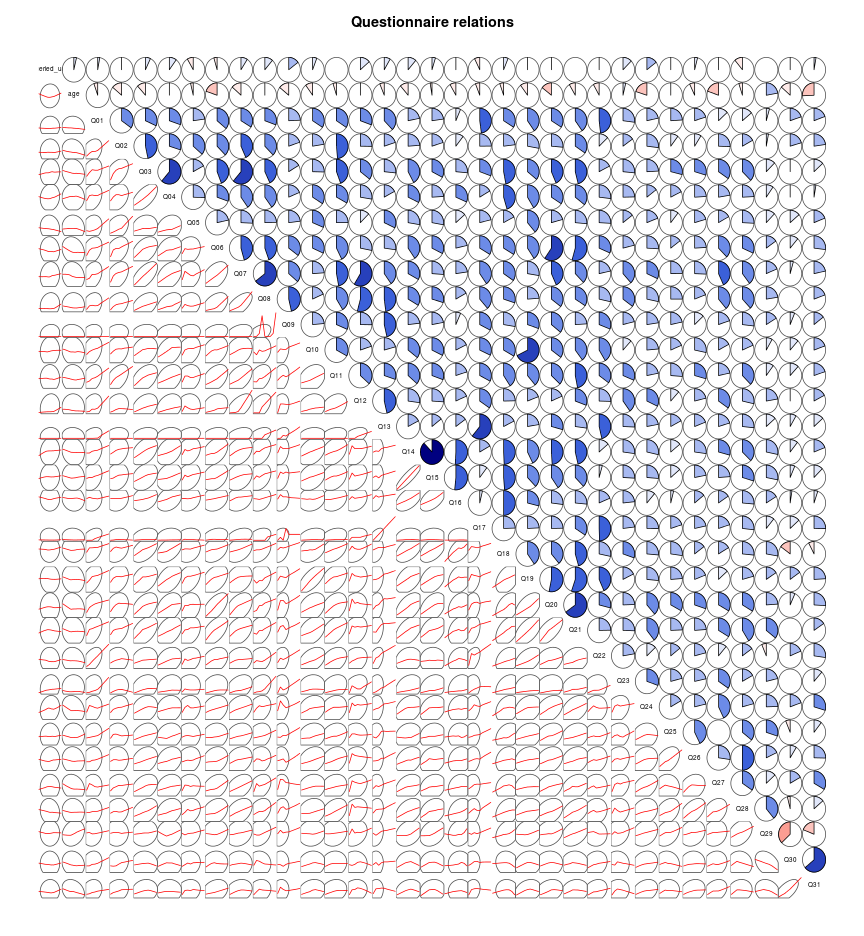
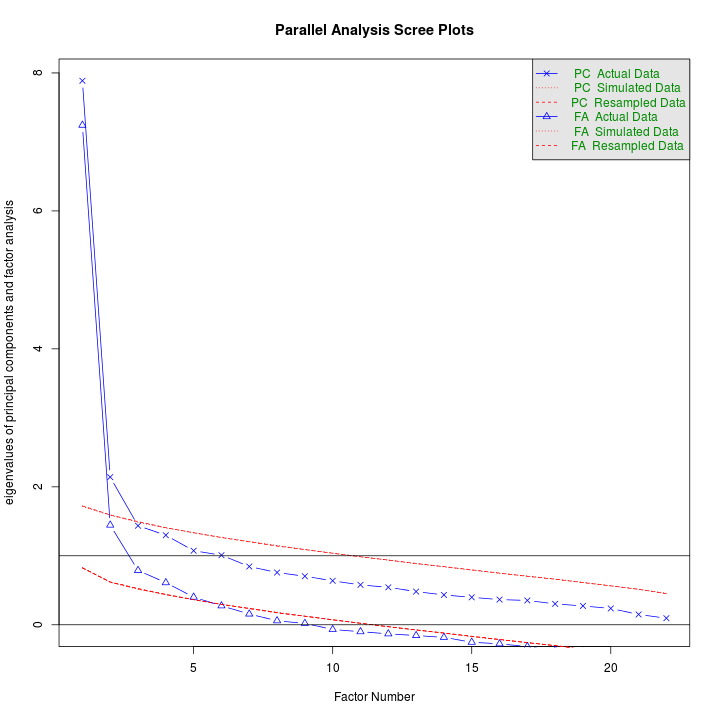
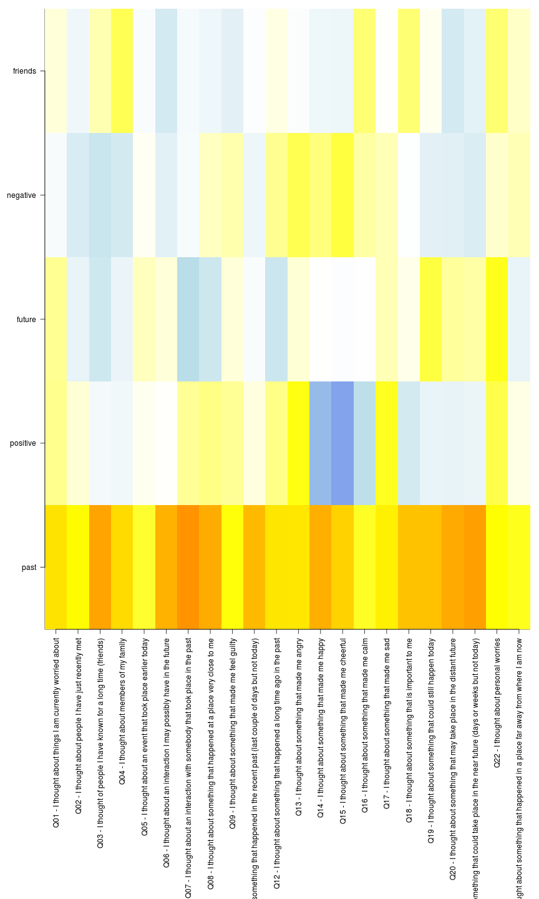
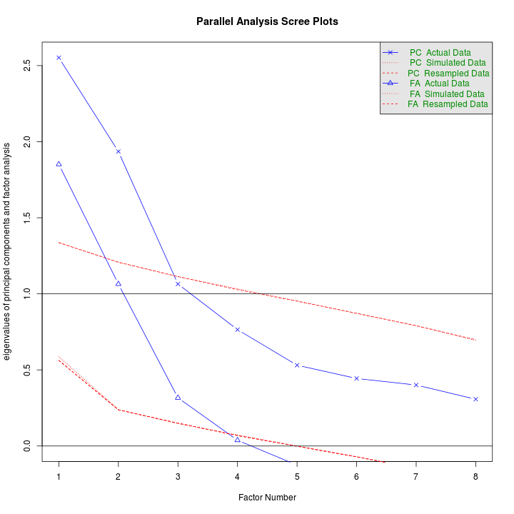
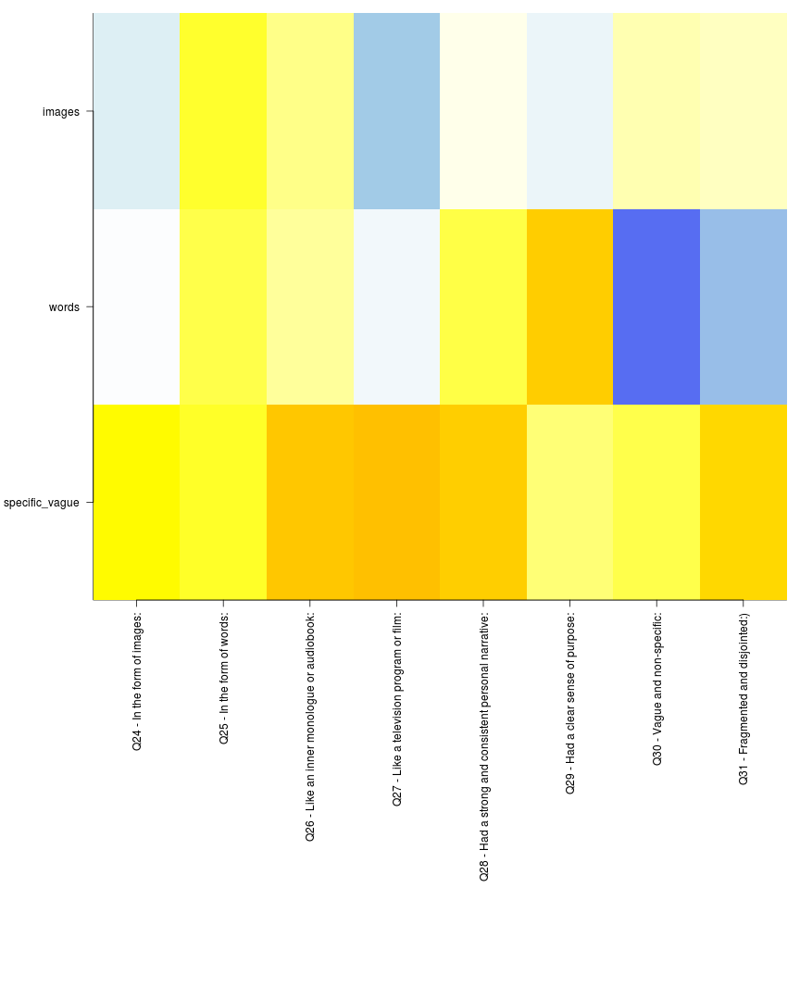

Questionnaire data analysis
===========================


Read the data:


```r
data = read.csv("/SCR/PowerFolder/Dropbox/papers/neural_correlates_of_mind_wandering/mriq_all_subs_18_60.csv")
first_labels = c("Q01 - I thought about things I am currently worried about", 
    "Q02 - I thought about people I have just recently met", "Q03 - I thought of people I have known for a long time (friends)", 
    "Q04 - I thought about members of my family", "Q05 - I thought about an event that took place earlier today", 
    "Q06 - I thought about an interaction I may possibly have in the future", 
    "Q07 - I thought about an interaction with somebody that took place in the past", 
    "Q08 - I thought about something that happened at a place very close to me", 
    "Q09 - I thought about something that made me feel guilty", "Q11 - I thought about something that happened in the recent past (last couple of days but not today)", 
    "Q12 - I thought about something that happened a long time ago in the past", 
    "Q13 - I thought about something that made me angry", "Q14 - I thought about something that made me happy", 
    "Q15 - I thought about something that made me cheerful", "Q16 - I thought about something that made me calm", 
    "Q17 - I thought about something that made me sad", "Q18 - I thought about something that is important to me", 
    "Q19 - I thought about something that could still happen today", "Q20 - I thought about something that may take place in the distant future", 
    "Q21 - I thought about something that could take place in the near future (days or weeks but not today)", 
    "Q22 - I thought about personal worries", "Q23 - I thought about something that happened in a place far away from where I am now")

second_labels = c("Q24 - In the form of images:", "Q25 - In the form of words:", 
    "Q26 - Like an inner monologue or audiobook:", "Q27 - Like a television program or film:", 
    "Q28 - Had a strong and consistent personal narrative:", "Q29 - Had a clear sense of purpose:", 
    "Q30 - Vague and non-specific:", "Q31 - Fragmented and disjointed:)")
first_ind = c(4, 5, 6, 7, 8, 9, 10, 11, 12, 14, 15, 16, 17, 18, 19, 20, 21, 
    22, 23, 24, 25, 26)
second_ind = c(27, 28, 29, 30, 31, 32, 33, 34)
data$sex = factor(data$sex, levels = c(1, 2), labels = c("male", "female"))
summary(data)
```

```
##   queried_ursi         age           sex           Q01      
##  Min.   :100464   Min.   :18.0   male  : 64   Min.   :1.00  
##  1st Qu.:123065   1st Qu.:23.2   female:102   1st Qu.:1.00  
##  Median :148763   Median :39.0                Median :2.00  
##  Mean   :149902   Mean   :37.8                Mean   :2.89  
##  3rd Qu.:174755   3rd Qu.:50.8                3rd Qu.:4.00  
##  Max.   :199620   Max.   :60.0                Max.   :9.00  
##       Q02            Q03            Q04            Q05      
##  Min.   :1.00   Min.   :1.00   Min.   :1.00   Min.   :1.00  
##  1st Qu.:1.00   1st Qu.:1.00   1st Qu.:2.00   1st Qu.:1.00  
##  Median :2.00   Median :5.00   Median :5.00   Median :2.00  
##  Mean   :3.27   Mean   :4.69   Mean   :4.93   Mean   :3.24  
##  3rd Qu.:5.00   3rd Qu.:7.75   3rd Qu.:8.00   3rd Qu.:5.00  
##  Max.   :9.00   Max.   :9.00   Max.   :9.00   Max.   :9.00  
##       Q06            Q07            Q08            Q09      
##  Min.   :1.00   Min.   :1.00   Min.   :1.00   Min.   :1.00  
##  1st Qu.:1.00   1st Qu.:1.00   1st Qu.:1.00   1st Qu.:1.00  
##  Median :4.00   Median :4.00   Median :1.00   Median :1.00  
##  Mean   :4.22   Mean   :4.28   Mean   :2.98   Mean   :1.92  
##  3rd Qu.:7.00   3rd Qu.:7.00   3rd Qu.:5.00   3rd Qu.:1.00  
##  Max.   :9.00   Max.   :9.00   Max.   :9.00   Max.   :9.00  
##       Q10            Q11            Q12            Q13      
##  Min.   :1.00   Min.   :1.00   Min.   :1.00   Min.   :1.00  
##  1st Qu.:1.00   1st Qu.:1.00   1st Qu.:1.00   1st Qu.:1.00  
##  Median :5.00   Median :3.00   Median :1.00   Median :1.00  
##  Mean   :4.69   Mean   :4.05   Mean   :2.98   Mean   :1.77  
##  3rd Qu.:8.00   3rd Qu.:7.00   3rd Qu.:5.00   3rd Qu.:1.00  
##  Max.   :9.00   Max.   :9.00   Max.   :9.00   Max.   :9.00  
##       Q14            Q15            Q16            Q17      
##  Min.   :1.00   Min.   :1.00   Min.   :1.00   Min.   :1.00  
##  1st Qu.:1.25   1st Qu.:2.00   1st Qu.:5.00   1st Qu.:1.00  
##  Median :5.50   Median :5.00   Median :7.00   Median :1.00  
##  Mean   :5.17   Mean   :5.19   Mean   :6.35   Mean   :2.03  
##  3rd Qu.:8.00   3rd Qu.:8.00   3rd Qu.:9.00   3rd Qu.:2.00  
##  Max.   :9.00   Max.   :9.00   Max.   :9.00   Max.   :9.00  
##       Q18            Q19            Q20            Q21      
##  Min.   :1.00   Min.   :1.00   Min.   :1.00   Min.   :1.00  
##  1st Qu.:5.00   1st Qu.:1.00   1st Qu.:1.00   1st Qu.:1.00  
##  Median :7.00   Median :5.00   Median :3.50   Median :5.00  
##  Mean   :6.39   Mean   :5.14   Mean   :4.19   Mean   :4.87  
##  3rd Qu.:9.00   3rd Qu.:8.00   3rd Qu.:7.00   3rd Qu.:8.00  
##  Max.   :9.00   Max.   :9.00   Max.   :9.00   Max.   :9.00  
##       Q22            Q23            Q24            Q25      
##  Min.   :1.00   Min.   :1.00   Min.   :1.00   Min.   :1.00  
##  1st Qu.:1.00   1st Qu.:1.00   1st Qu.:1.00   1st Qu.:1.00  
##  Median :2.00   Median :1.00   Median :4.00   Median :3.00  
##  Mean   :3.57   Mean   :2.90   Mean   :4.27   Mean   :3.79  
##  3rd Qu.:6.00   3rd Qu.:4.75   3rd Qu.:7.00   3rd Qu.:6.00  
##  Max.   :9.00   Max.   :9.00   Max.   :9.00   Max.   :9.00  
##       Q26            Q27            Q28            Q29      
##  Min.   :1.00   Min.   :1.00   Min.   :1.00   Min.   :1.00  
##  1st Qu.:1.00   1st Qu.:1.00   1st Qu.:1.00   1st Qu.:3.00  
##  Median :4.00   Median :3.00   Median :3.50   Median :6.00  
##  Mean   :4.19   Mean   :3.72   Mean   :4.07   Mean   :5.39  
##  3rd Qu.:7.00   3rd Qu.:6.00   3rd Qu.:7.00   3rd Qu.:8.00  
##  Max.   :9.00   Max.   :9.00   Max.   :9.00   Max.   :9.00  
##       Q30            Q31      
##  Min.   :1.00   Min.   :1.00  
##  1st Qu.:1.00   1st Qu.:1.00  
##  Median :3.00   Median :2.00  
##  Mean   :3.66   Mean   :3.07  
##  3rd Qu.:6.00   3rd Qu.:5.00  
##  Max.   :9.00   Max.   :9.00
```


Plot pairwise relations:

```r

corrgram(data, order = FALSE, lower.panel = panel.ellipse, upper.panel = panel.pie, 
    text.panel = panel.txt, main = "Questionnaire relations")
```

 


Scale the data.

```r
# data[c(first_ind,second_ind)] = scale(data[c(first_ind,second_ind)])
```


Figure out how many components to use to do EFA on the first part:

```r
f = fa.parallel(data[first_ind], fm = "pa", n.iter = 100)
```

 

```
## Parallel analysis suggests that the number of factors =  5  and the number of components =  2
```


Fit EFA with 5 components sparse rotations

```r
first_fit = fa(data[first_ind], nfactors = 5, scores = "tenBerge", fm = "pa", 
    rotate = "oblimin")
```

```
## Loading required package: GPArotation
```

```
## Warning: there is no package called 'GPArotation'
```

```
## Warning: I am sorry, to do these rotations requires the GPArotation
## package to be installed
```

```r
first_fit
```

```
## Factor Analysis using method =  pa
## Call: fa(r = data[first_ind], nfactors = 5, rotate = "oblimin", scores = "tenBerge", 
##     fm = "pa")
## Standardized loadings (pattern matrix) based upon correlation matrix
##      PA1   PA2   PA3   PA4   PA5   h2   u2
## Q01 0.55  0.22  0.21 -0.05  0.07 0.41 0.59
## Q02 0.50  0.08 -0.14 -0.24 -0.09 0.34 0.66
## Q03 0.68 -0.07 -0.29 -0.33  0.15 0.68 0.32
## Q04 0.57 -0.08 -0.12 -0.26  0.33 0.53 0.47
## Q05 0.41  0.03  0.13  0.02 -0.03 0.18 0.82
## Q06 0.65  0.00  0.07 -0.18 -0.26 0.53 0.47
## Q07 0.71  0.21 -0.43 -0.05 -0.06 0.73 0.27
## Q08 0.66  0.24 -0.30  0.12 -0.10 0.61 0.39
## Q09 0.48  0.20  0.07  0.16 -0.17 0.33 0.67
## Q11 0.63  0.06 -0.03 -0.11 -0.02 0.42 0.58
## Q12 0.55  0.23 -0.31  0.21  0.05 0.50 0.50
## Q13 0.55  0.46  0.08  0.34 -0.02 0.63 0.37
## Q14 0.66 -0.57  0.00  0.26 -0.10 0.82 0.18
## Q15 0.59 -0.62 -0.02  0.37 -0.10 0.88 0.12
## Q16 0.42 -0.41  0.00  0.18  0.27 0.45 0.55
## Q17 0.53  0.44  0.14  0.14  0.01 0.51 0.49
## Q18 0.62 -0.26  0.04 -0.01  0.27 0.53 0.47
## Q19 0.62 -0.13  0.37 -0.17  0.03 0.57 0.43
## Q20 0.66 -0.15  0.20 -0.18 -0.26 0.60 0.40
## Q21 0.68 -0.12  0.17 -0.23 -0.17 0.59 0.41
## Q22 0.50  0.35  0.45  0.10  0.28 0.66 0.34
## Q23 0.44  0.05 -0.14  0.14  0.11 0.25 0.75
## 
##                        PA1  PA2  PA3  PA4  PA5
## SS loadings           7.45 1.79 1.01 0.88 0.61
## Proportion Var        0.34 0.08 0.05 0.04 0.03
## Cumulative Var        0.34 0.42 0.47 0.51 0.53
## Proportion Explained  0.63 0.15 0.09 0.07 0.05
## Cumulative Proportion 0.63 0.79 0.87 0.95 1.00
## 
## Test of the hypothesis that 5 factors are sufficient.
## 
## The degrees of freedom for the null model are  231  and the objective function was  11.59 with Chi Square of  1818
## The degrees of freedom for the model are 131  and the objective function was  1.53 
## 
## The root mean square of the residuals (RMSR) is  0.04 
## The df corrected root mean square of the residuals is  0.07 
## 
## The harmonic number of observations is  166 with the empirical chi square  105.3  with prob <  0.95 
## The total number of observations was  166  with MLE Chi Square =  235.2  with prob <  6.3e-08 
## 
## Tucker Lewis Index of factoring reliability =  0.881
## RMSEA index =  0.075  and the 90 % confidence intervals are  0.055 0.083
## BIC =  -434.5
## Fit based upon off diagonal values = 0.99
## Measures of factor score adequacy             
##                                                 PA1  PA2  PA3  PA4  PA5
## Correlation of scores with factors             0.98 0.93 0.86 0.86 0.76
## Multiple R square of scores with factors       0.95 0.86 0.73 0.74 0.58
## Minimum correlation of possible factor scores  0.90 0.72 0.46 0.48 0.16
```

```r
jet.colors <- colorRampPalette(c("blue", "light blue", "white", "yellow", "red"))
first_interpretation = c("past", "positive", "future", "negative", "friends")
op <- par(mar = c(30, 5, 1, 1))
image(loadings(first_fit), yaxt = "n", xaxt = "n", col = jet.colors(1200), zlim = c(-1, 
    1))
axis(2, at = seq(0, 1, , dim(first_fit$loadings)[2]), labels = first_interpretation, 
    las = 2)
axis(1, at = seq(0, 1, , dim(first_fit$loadings)[1]), labels = first_labels, 
    las = 2)
```

 

```r
rm(op)
```


Figure out how many components to use to do EFA on the second part:

```r
fa.parallel(data[second_ind], fm = "pa", n.iter = 500)
```

```
## The estimated weights for the factor scores are probably incorrect.  Try a
## different factor extraction method.
```

```
## The estimated weights for the factor scores are probably incorrect.  Try a
## different factor extraction method.
```

```
## The estimated weights for the factor scores are probably incorrect.  Try a
## different factor extraction method.
```

```
## The estimated weights for the factor scores are probably incorrect.  Try a
## different factor extraction method.
```

```
## The estimated weights for the factor scores are probably incorrect.  Try a
## different factor extraction method.
```

```
## The estimated weights for the factor scores are probably incorrect.  Try a
## different factor extraction method.
```

```
## The estimated weights for the factor scores are probably incorrect.  Try a
## different factor extraction method.
```

```
## The estimated weights for the factor scores are probably incorrect.  Try a
## different factor extraction method.
```

```
## The estimated weights for the factor scores are probably incorrect.  Try a
## different factor extraction method.
```

```
## The estimated weights for the factor scores are probably incorrect.  Try a
## different factor extraction method.
```

```
## The estimated weights for the factor scores are probably incorrect.  Try a
## different factor extraction method.
```

```
## The estimated weights for the factor scores are probably incorrect.  Try a
## different factor extraction method.
```

```
## The estimated weights for the factor scores are probably incorrect.  Try a
## different factor extraction method.
```

```
## The estimated weights for the factor scores are probably incorrect.  Try a
## different factor extraction method.
```

```
## The estimated weights for the factor scores are probably incorrect.  Try a
## different factor extraction method.
```

```
## The estimated weights for the factor scores are probably incorrect.  Try a
## different factor extraction method.
```

```
## The estimated weights for the factor scores are probably incorrect.  Try a
## different factor extraction method.
```

```
## The estimated weights for the factor scores are probably incorrect.  Try a
## different factor extraction method.
```

```
## The estimated weights for the factor scores are probably incorrect.  Try a
## different factor extraction method.
```

 

```
## Parallel analysis suggests that the number of factors =  3  and the number of components =  2
```


Fit EFA with 3 components sparse rotations

```r
second_fit = fa(data[second_ind], nfactors = 3, scores = "tenBerge", fm = "pa", 
    rotate = "oblimin")
```

```
## Loading required package: GPArotation
```

```
## Warning: there is no package called 'GPArotation'
```

```
## Warning: I am sorry, to do these rotations requires the GPArotation
## package to be installed
```

```r
second_fit
```

```
## Factor Analysis using method =  pa
## Call: fa(r = data[second_ind], nfactors = 3, rotate = "oblimin", scores = "tenBerge", 
##     fm = "pa")
## Standardized loadings (pattern matrix) based upon correlation matrix
##      PA1   PA2   PA3   h2   u2
## Q24 0.51 -0.02 -0.20 0.30 0.70
## Q25 0.42  0.35  0.41 0.47 0.53
## Q26 0.61  0.19  0.23 0.46 0.54
## Q27 0.62 -0.08 -0.53 0.67 0.33
## Q28 0.59  0.36  0.04 0.49 0.51
## Q29 0.27  0.60 -0.12 0.44 0.56
## Q30 0.35 -0.75  0.15 0.70 0.30
## Q31 0.58 -0.56  0.12 0.66 0.34
## 
##                        PA1  PA2  PA3
## SS loadings           2.07 1.53 0.60
## Proportion Var        0.26 0.19 0.07
## Cumulative Var        0.26 0.45 0.52
## Proportion Explained  0.49 0.36 0.14
## Cumulative Proportion 0.49 0.86 1.00
## 
## Test of the hypothesis that 3 factors are sufficient.
## 
## The degrees of freedom for the null model are  28  and the objective function was  2.15 with Chi Square of  346.8
## The degrees of freedom for the model are 7  and the objective function was  0.13 
## 
## The root mean square of the residuals (RMSR) is  0.04 
## The df corrected root mean square of the residuals is  0.1 
## 
## The harmonic number of observations is  166 with the empirical chi square  12.58  with prob <  0.083 
## The total number of observations was  166  with MLE Chi Square =  20.11  with prob <  0.0053 
## 
## Tucker Lewis Index of factoring reliability =  0.833
## RMSEA index =  0.109  and the 90 % confidence intervals are  0.054 0.162
## BIC =  -15.67
## Fit based upon off diagonal values = 0.98
## Measures of factor score adequacy             
##                                                 PA1  PA2  PA3
## Correlation of scores with factors             0.91 0.89 0.77
## Multiple R square of scores with factors       0.82 0.80 0.59
## Minimum correlation of possible factor scores  0.65 0.59 0.19
```

```r

second_interpretation = c("specific_vague", "words", "images")
op <- par(mar = c(30, 7, 1, 1))
image(loadings(second_fit), yaxt = "n", xaxt = "n", col = jet.colors(1200), 
    zlim = c(-1, 1))
axis(2, at = seq(0, 1, , dim(loadings(second_fit))[2]), labels = second_interpretation, 
    las = 2)
axis(1, at = seq(0, 1, , dim(loadings(second_fit))[1]), labels = second_labels, 
    las = 2)
```

 

```r
rm(op)
```


Constructing the final variables:

```r
regressors = data[c(1, 2, 3)]
regressors$firstSum = rowSums(data[first_ind])
regressors$secondSum = rowSums(data[second_ind])
regressors$allSum = regressors$firstSum + regressors$secondSum
first_scores = first_fit$scores
colnames(first_scores) = first_interpretation
regressors = cbind(regressors, first_scores)
second_scores = second_fit$scores
colnames(second_scores) = second_interpretation
regressors = cbind(regressors, second_scores)
more_measures = read.csv("/SCR/PowerFolder/Dropbox/papers/neural_correlates_of_mind_wandering/mriq_ga_full_phenotypic_no_scales_cleaned.csv")[c(1, 
    4, 36)]
regressors = merge(regressors, more_measures, by.x = "queried_ursi", by.y = "sub_id")
# regressors[c(-1)] = scale(regressors[c(-1)], scale=FALSE)
summary(regressors[c(2, 7, 8, 9, 10, 11, 12, 13, 14)])
```

```
##       age            past            positive          future       
##  Min.   :18.0   Min.   :-1.6840   Min.   :-1.911   Min.   :-3.0620  
##  1st Qu.:23.0   1st Qu.:-0.7130   1st Qu.:-0.931   1st Qu.:-0.4858  
##  Median :40.0   Median :-0.0196   Median :-0.039   Median : 0.0029  
##  Mean   :37.6   Mean   : 0.0446   Mean   :-0.059   Mean   :-0.0158  
##  3rd Qu.:49.0   3rd Qu.: 0.6927   3rd Qu.: 0.674   3rd Qu.: 0.6759  
##  Max.   :60.0   Max.   : 2.8430   Max.   : 3.467   Max.   : 2.0790  
##     negative          friends        specific_vague        words        
##  Min.   :-2.0692   Min.   :-2.8564   Min.   :-1.7614   Min.   :-2.6618  
##  1st Qu.:-0.7099   1st Qu.:-0.6363   1st Qu.:-0.7676   1st Qu.:-0.7339  
##  Median :-0.0943   Median : 0.0433   Median : 0.0689   Median : 0.0882  
##  Mean   :-0.0529   Mean   : 0.0605   Mean   : 0.0660   Mean   : 0.0110  
##  3rd Qu.: 0.4812   3rd Qu.: 0.5940   3rd Qu.: 0.7017   3rd Qu.: 0.6320  
##  Max.   : 2.6560   Max.   : 2.4758   Max.   : 3.1180   Max.   : 2.0698  
##      images       
##  Min.   :-2.6351  
##  1st Qu.:-0.6959  
##  Median : 0.0185  
##  Mean   : 0.0529  
##  3rd Qu.: 0.7986  
##  Max.   : 2.3258
```

```r
write.csv(regressors, file = "/SCR/PowerFolder/Dropbox/papers/neural_correlates_of_mind_wandering/regressors.csv")
```

